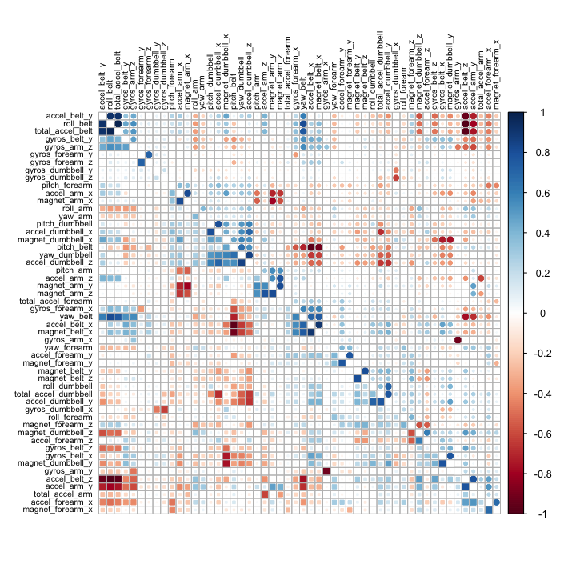

[**CLICK HERE to see report in html**](https://reyvaz.github.io/Machine-Learning-Accelerometer/barbellRmd.html)  

## Machine Learning on Accelerometer Data

This repository contains the R code for different machine learning algorithms. Accelerometer data is used to predict how well individuals perform weight-lifting exercises. The dataset comes from Veloso et al., (2013) and it contains data from accelerometers on the belt, forearm, arm, and dumbbell from 6 individuals.  

The dataset comprises information on 6 participants who were asked to perform one set of 10 repetitions of the unilateral dumbbell biceps curl in five different ways: correctly; throwing the elbows to the front; lifting the dumbbell only halfway; lowering the dumbbell only halfway; and throwing the hips to the front. More information on the dataset can be found [here](http://groupware.les.inf.puc-rio.br/har).   

The code in this repository processes the data and constructs 3 different machine learning algorithms, including CART, Random Forest, and Boosted (GBM) to predict the way dumbbell biceps curls were performed. 

The best performing algorithm is a Random Forest specification with 99.3% accuracy, followed by a Boosted GBM with 94.3% accuracy, in the testing dataset.

The dataset is available [here](https://d396qusza40orc.cloudfront.net/predmachlearn/pml-training.csv). 

* The rendered html version of the code is found  [here](https://reyvaz.github.io/Machine-Learning-Accelerometer/barbellRmd.html). 

* To reproduce the results, source the  [barbellRmd.Rmd](barbellRmd.Rmd) file with the downloaded data files 

* The file [barbellRmd.md](barbellRmd.md) contains the code and output rendered in a markdown file. 

* [GitHub Pages Link](https://reyvaz.github.io/Machine-Learning-Accelerometer/)

* README.md this file

  

  

