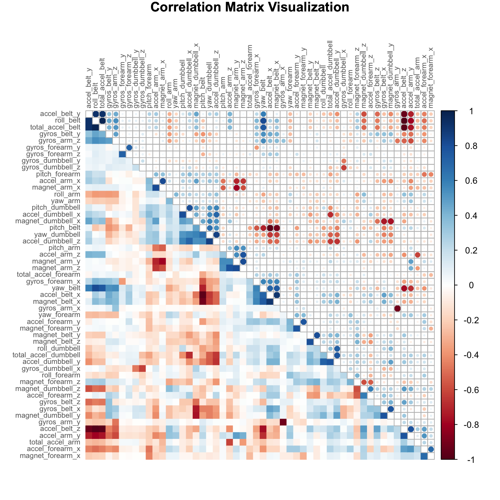
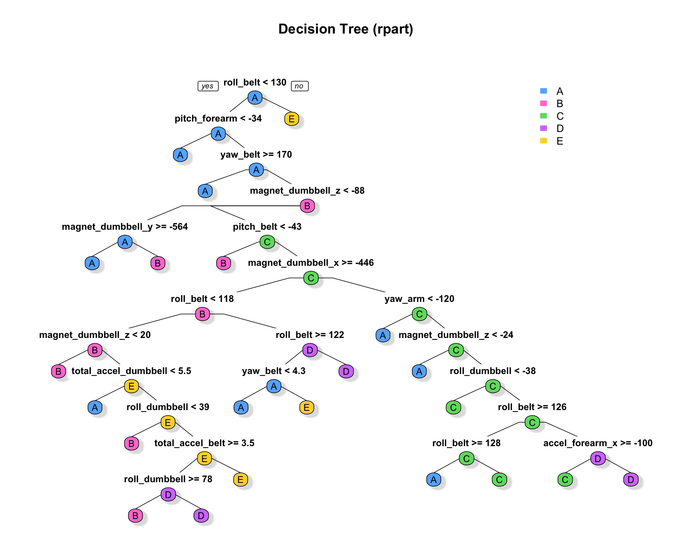

# Machine Learning Exercise
Reynaldo  
5/9/2017  


## Summary  
This analysis uses different machine learning algorithms on accelerometer data to predict how well individuals perform weight-lifting exercises. The dataset comes from Veloso et al., (2013) and it contains data from accelerometers on the belt, forearm, arm, and dumbbell from 6 individuals.

The participants were asked to perform one set of 10 repetitions of the unilateral dumbbell biceps curl in five different ways: according to specification (class A), throwing the elbows to the front (B), lifting the dumbbell only halfway (C), lowering the dumbbell only halfway (D), and throwing the hips to the front (E).  

The following tests different machine learning algorithms, including CART, Random Forest, and Boosted GBM to predict how well the dumbbell biceps curl were performed (variable classe in the dataset).  The best performing algorithm is a Random Forest specification with $99.4\%$ accuracy, followed by a Boosted GBM with $94.3\%$ accuracy, both in the cross-validation dataset. 

1. Necessary packages

```r
library(caret); library(dplyr); library(knitr); library(pander)
library(rpart); library(rpart.plot); library(gbm)
library(randomForest); library(ggRandomForests); library(corrplot)
```
## Data Processing  
The training dataset is available [here](https://d396qusza40orc.cloudfront.net/predmachlearn/pml-training.csv). And the test dataset is available [here](https://d396qusza40orc.cloudfront.net/predmachlearn/pml-testing.csv).   

2. Data

```r
test  <- read.csv("pml-testing.csv")
train <- read.csv("pml-training.csv")
names(train)
str(train)
```
The original dataset contains $19622$ observations of $160$ variables. Preliminary analysis found: (a) a large number of variables with near zero variability; (b) the first columns contain recording and identification data irrelevant to the prediction; and (c) a significant number of variables with less than $10\%$ of valid observations. The variables with these characteristics are thus discarded.  

3. Discard variables    
        a. discard variables with near zero variance      
        b. discard variables irrelevant to prediction, columns 1-6      
        c. discard variables with 80% NAs or more

```r
nrzv  <- nearZeroVar(train)
train <- train[,-nrzv]
train <- train[, -c(1:6)]
xNAs  <- which(colMeans(is.na(train)) > .8)
train <- train[, -xNAs]
```

**Cross-validation dataset**  
Data is then split into a training dataset with 60% of observations for model training, and a testing dataset with the remaining 40% of observations for cross-validation.   

4. Split data for cross-validation

```r
set.seed(400)
inTrain  = createDataPartition(train$classe, p = 3/5)[[1]]
training = train[ inTrain,]
testing  = train[-inTrain,]
```

**Pre-processing**  
The training dataset now contains $11776$ observations of $53$ variables, all cells with valid entries. Although correlation analysis, as seen in the figure below, shows a high correlation between a significant number of predictors, no further manual pre-processing will be performed for the remaining of the analysis. As a note, PCA decomposition was able to capture $95\%$ of the variance by reducing the number of components by over $50\%$ but accuracy was significantly compromised, while expediency gains were only minor. Because of the nature of decision trees (i.e. they can branch at equivalent splitting points) scaling or translational normalization is not necessary. Furthermore, they are also robust to correlated variates.  


```r
par(xpd=TRUE)
corrplot.mixed(cor(training[,-length(training)]), lower="color", upper="circle", mar=c(1,1,1,1),
               tl.pos="lt", diag="n", title = "Correlation Matrix Visualization",
               order="hclust", hclust.method="complete", tl.cex = .65, tl.col ="#656565")
```



## Machine Learning Specifications  

The following will test and compare the performance of 3 different machine learning algorithms: CART, Random Forest, and Boosted GBM. 

5. First Model: Classification and Regression Tree (CART)

```r
rpart1    <- rpart(classe ~ ., method="class", data=training)
testrpart <- predict(rpart1, newdata = testing[,-length(testing)], type = "class")
cm1       <- confusionMatrix(testing$classe, testrpart)
```


```r
rpart.plot(rpart1, main="Decision Tree (rpart)", type = 1, extra=0, cex = NULL, 
           tweak = 1, fallen.leaves = FALSE, shadow.col = "#e0e0e0", box.palette = mycolors)
```



6. Second Model: Random Forest (RF)

```r
rfm     <- randomForest(training[,-length(training)], training[,length(training)], ntree = 500)
testrfm <- predict(rfm, newdata = testing[,-length(testing)])
cm2     <- confusionMatrix(testing$classe, testrfm)
```


7. Third Model: Boosting (GBM)

```r
gbm1      <- gbm.fit(x = training[,-length(training)], y = training[,length(training)],
                        distribution = "multinomial", verbose = FALSE, 
                        interaction.depth=5, shrinkage=0.005, n.trees = 1000)
best.iter <- gbm.perf(gbm1,method="OOB", plot.it = FALSE)
probs     <- predict(gbm1, testing[,-length(testing)], n.trees = best.iter, type = "response")
indexes   <- apply(probs, 1, which.max)
testgbm   <- colnames(probs)[indexes]
cm3       <- confusionMatrix(testing$classe, testgbm)
```


## Algorithm Performance Comparison

The following are some extractions from the Confusion Matrix for each specification. These calculations were done on the cross-validation dataset and should be an unbiased estimate of out of sample performance.  

10. Performance Comparison

```r
Accuracy <- as.numeric(c(cm1$overall[1], cm2$overall[1], cm3$overall[1]))
Kappa    <- as.numeric(c(cm1$overall[2], cm2$overall[2], cm3$overall[2]))
OOBError <- 1 - Accuracy
Results <- rbind(Accuracy, Kappa, OOBError)
colnames(Results) <- c("CART", "Random Forest", "Boosted (GBM)")
```

The calculated Accuracy rates, Kappas, and Out of Sample Error rates estimates for each specification are:  


```
##               CART Random Forest Boosted (GBM)
## Accuracy 0.7243181   0.993372419    0.94341066
## Kappa    0.6496212   0.991615676    0.92838601
## OOBError 0.2756819   0.006627581    0.05658934
```

Performance metrics indicate that the Random Forest is the best performing algorithm for this purpose with an accuracy rate of $0.9933724$. It is followed by the GBM algorithm with an accuracy rate of $0.9434107$. And last, is the CART algorithm which performed poorly compared to the other 2 with an accuracy rate of $0.7243181$.   

The following reports the Confusion Matrices for the 2 best performing algorithms, and Class Specific statistics for the Random Forest specification.   


**Confusion Matrix (GMB Model)**  

```
##           Reference
## Prediction    A    B    C    D    E
##          A 2175   30   10   13    4
##          B   75 1384   55    3    1
##          C    0   60 1279   24    5
##          D    3   12   57 1208    6
##          E   12   29   27   18 1356
```
 
**Confusion Matrix (Random Forest Model)**  

```
##           Reference
## Prediction    A    B    C    D    E
##          A 2231    1    0    0    0
##          B    8 1504    6    0    0
##          C    0   20 1346    2    0
##          D    0    0   12 1274    0
##          E    0    0    3    0 1439
```

**Statistics By Class (Random Forest Model)**

```
##                       Class: A  Class: B  Class: C  Class: D  Class: E
## Sensitivity          0.9964270 0.9862295 0.9846379 0.9984326 1.0000000
## Specificity          0.9998217 0.9977852 0.9966044 0.9981735 0.9995318
## Pos Pred Value       0.9995520 0.9907773 0.9839181 0.9906687 0.9979196
## Neg Pred Value       0.9985750 0.9966814 0.9967583 0.9996951 1.0000000
## Prevalence           0.2853683 0.1943666 0.1742289 0.1626306 0.1834056
## Detection Rate       0.2843487 0.1916900 0.1715524 0.1623757 0.1834056
## Detection Prevalence 0.2844762 0.1934744 0.1743564 0.1639052 0.1837879
## Balanced Accuracy    0.9981243 0.9920073 0.9906212 0.9983031 0.9997659
```
  
## Predicting on the test Dataset  

Now I will use the 2 best performing algorithms to predict how well individuals preform the dumbbell exercises using the test dataset for submission. 

11. Transforming the test dataset in the same way as training. Then using the Random Forest model for prediction

```r
test   <- test[,-nrzv]
test   <- test[, -c(1:6)]
test   <- test[, -xNAs]
test   <- test[,-length(test)]
testRF <- predict(rfm, newdata = test)
```

12. Using the GBM model for prediction. Compare predictions

```r
probs2   <- predict(gbm1, test, n.trees = best.iter, type = "response")
indexes2 <- apply(probs2, 1, which.max)
testGBM  <- as.factor(colnames(probs2)[indexes2])
answers  <- cbind.data.frame(testRF, testGBM)
identical(answers$testRF, answers$testGBM)
```

```
## [1] TRUE
```

The RF and the GBM predictions are identical. The answers to be submitted are:   


```
##                1   2   3   4   5   6   7   8   9   10  11  12  13  14  15 
## Random Forest: "B" "A" "B" "A" "A" "E" "D" "B" "A" "A" "B" "C" "B" "A" "E"
## Boosted (GBM)  "B" "A" "B" "A" "A" "E" "D" "B" "A" "A" "B" "C" "B" "A" "E"
##                16  17  18  19  20 
## Random Forest: "E" "A" "B" "B" "B"
## Boosted (GBM)  "E" "A" "B" "B" "B"
```

## Conclusion:   
This analysis used accelerometer data to predict how well individuals perform dumbbell-lifting exercises. Three machine-learning algorithms were tested: CART, Random Forest, and Boosted GBM. The best performing algorithm was the Random Forest with $99.4\%$ accuracy, followed by the Boosted GBM with $94.3\%$ accuracy, and worst performing was the CART algorithm, which performed poorly compared to the other 2 with a $72.4\%$ accuracy. 


**Reference:**   
Velloso, E.; Bulling, A.; Gellersen, H.; Ugulino, W.; Fuks, H. (2013) Qualitative Activity Recognition of Weight Lifting Exercises. *Proceedings of 4th International Conference in Cooperation with SIGCHI (Augmented Human '13)* . Stuttgart, Germany: ACM SIGCHI


